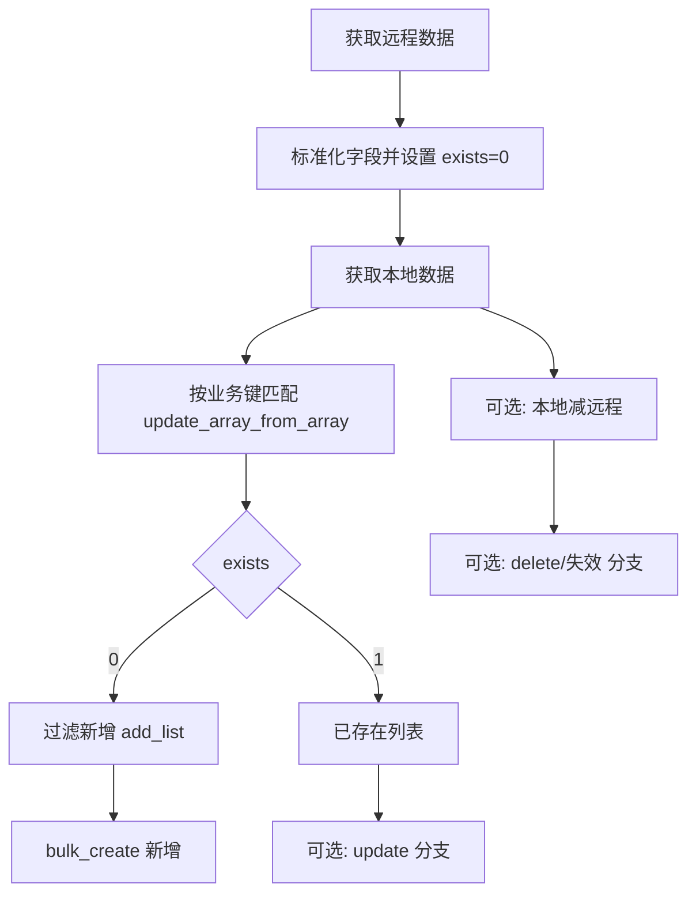

# sync_chat_contact 终结指南：`exists` 标记法做增量同步

这篇文档沉淀一个可复用的同步模型：  
本地一份数据、远程一份数据，先标记 `exists=0`，命中本地后改成 `exists=1`，再按标记分流做新增/删除/更新。

适用场景：
- 通讯录同步
- 用户/组织同步
- 商品/配置字典同步
- 任意“远程对比本地”的低代码流程

---

## 1. 一句话模型

1. 获取远程列表（标准化字段）。  
2. 远程每条先设 `exists=0`。  
3. 获取本地列表。  
4. 用业务键匹配：命中则把远程项更新为 `exists=1`。  
5. 过滤：
- `exists=0` => 新增候选（add_list）
- `exists=1` => 已存在（可用于更新或忽略）
6. 执行批量新增；需要时再扩展删除/更新分支。

---

## 2. `sync_chat_contact` 当前链路（实战）

以 `collect/hrm/sync_agency_data/index.yml` 中 `hrm.sync_chat_contact` 为例：

1. 先获取远程数据：
- 员工模式：直接查一个员工的通讯录。
- 旅行社模式：通过 `sync_chat_contact_bulk_query` 批量拉员工通讯录并整形成统一数组。

2. 远程数据标准化：
- `update_array` 写入业务字段（`wx_id`、`owner_wx_id` 等）
- 同时写 `exists: "0"`

3. 获取本地数据：
- 员工模式按 `agency_id + employee_id`
- 旅行社模式按 `agency_id`

4. 命中标记：
- `update_array_from_array` 做左右列表对齐匹配
- 命中后把 `exists` 更新为 `"1"`

5. 过滤新增：
- `filter_arr if_template: "{{eq .item.exists \`0\`}}"` 得到 `add_list`

6. 批量新增：
- `travel_chat_contact_bulk_create` 仅写 `add_list`

---

## 3. 核心流程图（可直接复用）



如果渲染环境不支持 Mermaid，可按上述节点顺序理解。

---

## 4. 最容易漏的坑：`xx&yy` 组合键顺序

这是高频事故点。

### 4.1 结论

`field` 与 `right_field` 如果使用组合键（如 `[wx_id&owner_wx_id]`），**顺序必须完全一致**。  
左边 `xx&yy`，右边也必须 `xx&yy`；写成 `yy&xx` 会全部匹配失败。

### 4.2 源码依据（关键点）

`RenderVar("[a&b]", item)` 会按声明顺序拼接：先 `a` 再 `b`（中间有固定分隔符）。  
`update_array_from_array` 用这个拼接字符串做 map 精确匹配。  
所以只要顺序不一致，即使字段值一样，也不会命中。

### 4.3 正反例

正例（可命中）：

```yml
field: "[wx_id&owner_wx_id]"
right_field: "[wx_id&owner_wx_id]"
```

反例（几乎全不命中）：

```yml
field: "[wx_id&owner_wx_id]"
right_field: "[owner_wx_id&wx_id]"
```

典型症状：
- `exists` 几乎都还是 `0`
- `add_list` 异常偏大
- 同步看起来“成功”，但重复新增很多

---

## 5. 如何从 `right` 取其他字段

在 `update_array_from_array` 的 `fields` 里，可以直接取右侧对象字段：

```yml
- key: update_array_from_array
  foreach: "[remote_list]"
  item: item
  field: "[wx_id&owner_wx_id]"
  right: "[local_list]"
  right_field: "[wx_id&owner_wx_id]"
  fields:
    - field: exists
      template: "1"
    - field: employee_id
      template: "[right.employee_id]"
    - field: agency_id
      template: "[right.agency_id]"
```

说明：
- `right.xxx` 只有在匹配命中时才可用。
- 未命中项会跳过该次 `fields` 更新（保持原值）。

---

## 6. 扩展为“新增+删除+更新”三分流

`exists` 标记法天然支持扩展：

1. 新增（远程有、本地无）  
远程列表标记后过滤 `exists=0`。

2. 删除（本地有、远程无）  
再做一轮反向对比：本地先标记，再用远程回填命中，过滤 `exists=0` 得到删除候选。

3. 更新（两边都有但字段变化）  
命中列表里比关键字段（或 `modify_time/hash`），过滤出 `update_list` 执行 `bulk_update`。

---

## 7. 通用模板（低代码）

```yml
# 1) 远程列表 remote_list，每项先 exists=0
- key: update_array
  foreach: "[remote_list]"
  item: item
  fields:
    - field: exists
      template: "0"

# 2) 本地列表 local_list
# 3) 命中标记 exists=1（业务键要同序）
- key: update_array_from_array
  foreach: "[remote_list]"
  item: item
  field: "[biz_a&biz_b]"
  right: "[local_list]"
  right_field: "[biz_a&biz_b]"
  fields:
    - field: exists
      template: "1"

# 4) 新增过滤
- key: filter_arr
  foreach: "[remote_list]"
  item: item
  if_template: "{{eq .item.exists `0`}}"
  save_field: add_list

# 5) 批量新增
- key: service2field
  enable: "{{must .add_list}}"
  service:
    service: xxx.bulk_create
    data_list: "[add_list]"
```

---

## 8. 固定排查顺序（推荐）

1. 远程列表长度是否正确。  
2. 本地列表长度是否正确。  
3. 组合键示例值（左右各抽 5 条）是否同序同值。  
4. `exists=1` 命中率是否符合预期。  
5. `add_list` 是否异常膨胀。  
6. 再看新增/删除/更新执行结果。

---

## 9. 给后续大模型的执行指令（建议）

做任何“远程 vs 本地”的同步时，优先套这个顺序：
1. 先定义业务键（必要时组合键）。  
2. 远程列表统一 `exists=0`。  
3. 用 `update_array_from_array` 命中改 `exists=1`。  
4. 通过 `filter_arr` 分流 add/remove/update。  
5. 最后再执行对应批处理服务。  

这样模型可稳定产出可维护、可解释的同步配置，而不是散乱的条件拼接。
